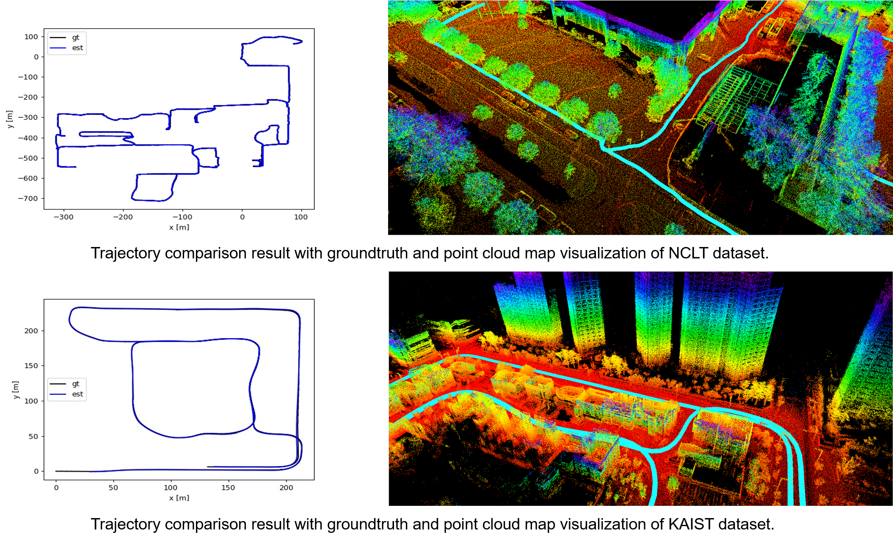
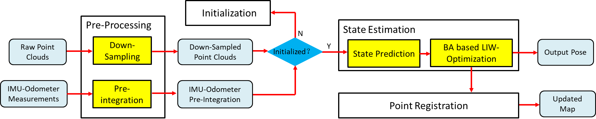

# LIW-OAM

**LIW-OAM** (Lidar-Inertial-Wheel Odometry and Mapping) is an accurate and robust bundle adjustment (BA) based LiDAR-inertial-wheel odometry and mapping system that can provide accurate pose esmation and dense point cloud map results. Compared with our previous work [SR-LIO](https://github.com/ZikangYuan/sr_lio), **LIW-OAM** can further improve the accuracy of pose estimation and guarantee the real-time performance.

## Related Work

[LIW-OAM: Lidar-Inertial-Wheel Odometry and Mapping](https://arxiv.org/abs/2302.14298)

Authors: [*Zikang Yuan*](https://scholar.google.com/citations?hl=zh-CN&user=acxdM9gAAAAJ), *Fengtian Lang*, *Tianle Xu* and [*Xin Yang*](https://scholar.google.com/citations?user=lsz8OOYAAAAJ&hl=zh-CN)

[SR-LIO: LiDAR-Inertial Odometry with Sweep Reconstruction](https://arxiv.org/abs/2210.10424)

Authors: [*Zikang Yuan*](https://scholar.google.com/citations?hl=zh-CN&user=acxdM9gAAAAJ), *Fengtian Lang* and [*Xin Yang*](https://scholar.google.com/citations?user=lsz8OOYAAAAJ&hl=zh-CN)

## Demo Figure (2023-02-28 Update)

<div align="center">

</div>

**Pipeline:**
<div align="center">

</div>

**New Features:**
1. Following [CT-ICP](https://github.com/jedeschaud/ct_icp), **LIW-OAM** represents the state of two moments in each sweep: 1) at the beginning time of a sweep, and 2) at the end time of the sweep.
2. Following [SR-LIO](https://arxiv.org/abs/2210.10424), **LIW-OAM** uses BA-based joint optimization framework, which is different from most EKF based systems.
3. **LIW-OAM** retains [SR-LIO](https://arxiv.org/abs/2210.10424)'s sweep reconstruction module, which can be performed by adjust the parameter "sweep_cut_num". However, we recommend that users do not use the sweep reconstruction function, because **LIW-OAM** can achieve higher pose estimation accuracy in real time without the requirement of sweep reconstruction.

## Installation

### 1. Requirements

> GCC >= 5.4.0
>
> Cmake >= 3.0.2
> 
> [Eigen3](http://eigen.tuxfamily.org/index.php?title=Main_Page) >= 3.2.8
>
> [PCL](https://pointclouds.org/downloads/) == 1.7 for Ubuntu 16.04, and == 1.8 for Ubuntu 18.04
>
> [Ceres](http://ceres-solver.org/installation.html) >= 1.14
>
> [ROS](http://wiki.ros.org/ROS/Installation)

##### Have Tested On:

| OS    | GCC  | Cmake | Eigen3 | PCL | Ceres |
|:-:|:-:|:-:|:-:|:-:|:-:|
| Ubuntu 16.04 | 5.4.0  | 3.16.0 | 3.2.8 | 1.7 | 1.14 |
| Ubuntu 18.04 | 7.5.0  | 3.11.2 | 3.3.4 | 1.8 | 1.14 |

### 2. Create ROS workspace

```bash
mkdir -p ~/LIW-OAM/src
cd LIW-OAM/src
```

### 3. Clone the directory and build

```bash
git clone https://github.com/ZikangYuan/liw_oam.git
cd ..
catkin_make
```
## Run on Public Datasets

Noted:

A. Except fot the external parameters between IMU and LiDAR, and the value of gravitational acceleration, **the parameter configurations used in different datasets are exactly the same** to demonstrate the stability and robustness of the **LIW-OAM**.

B. Please make sure the LiDAR point clouds have the "ring" channel information.

C. The warning message "Failed to find match for field 'time'." doesn't matter. It can be ignored.

D. **Please create a folder named "output" before running.** When **LIW-OAM** is running, the estimated pose is recorded in real time in the **pose.txt** located in the **output folder**.

E. If you want to get some visualization of the split and recombine, please set the **debug_output** parameter in the launch file to 1 (true). After that, you can get some .pcd files in **"output/cloud_frame"** and **"output/cut_sweep"** folders.

F. In order to facilitate evaluation, **we store the pose ground truth of the three datasets used by us as [TUM](https://vision.in.tum.de/data/datasets/rgbd-dataset) format. Please down load from [Google drive](https://drive.google.com/drive/folders/1WnvzUzP_s70p4myPf5fsP1Jtr_62PnL1)**.


###  1. Run on [*NCLT*](http://robots.engin.umich.edu/nclt/)

The time for finishing a sweep by the LiDAR of *NCLT* is not 100ms, but 130~140ms (around 7 Hz). **Different from [SR-LIO](https://arxiv.org/abs/2210.10424), we package the data stream of the *NCLT* dataset as 10 Hz sweep packages.** The **nclt_to_rosbag_10Hz.py** in the **"tools"** folder can be used to package 10 Hz sweeps and linearly interpolated 100 Hz IMU data into a rosbag file:

```bash
python3 nclt_to_rosbag_10Hz.py PATH_OF_NVLT_SEQUENCE_FOLDER PATH_OF_OUTPUT_BAG
```

Then, please go to the workspace of LIW-OAM and type:

```bash
cd LIW-OAM
sourcr devel/setup.bash
roslaunch liw_oam liw_nclt.launch
```

Then open the terminal in the path of the bag file, and type:

```bash
rosbag play SEQUENCE_NAME.bag --clock -d 1.0 -r 1.0
```

### 2. Run on [*KAIST*](https://sites.google.com/view/complex-urban-dataset)

For point clouds, we utilize the data from both two 3D LiDARs of *KAIST*. Users can package the rosbag according to the tool [kaist2bag](https://github.com/ZikangYuan/kaist2bag). The partial test sequences of *KAIST* used by us can also be downloaded from [Google drive](https://drive.google.com/drive/folders/1upQuR9cWoawM6MuPYxSpPQPlRLK7sDWU). 

Chinese users can download the test sequences of *KAIST* form [baidu yun](https://pan.baidu.com/s/1vrat2HdTf6NBrjw_kGCZNw), while the password is **s4bw**.

Please go to the workspace of LIW-OAM and type:

```bash
sourcr devel/setup.bash
roslaunch liw_oam liw_kaist.launch
```

Then open the terminal in the path of the bag file, and type:

```bash
rosbag play SEQUENCE_NAME.bag --clock -d 1.0 -r 1.0
```

## Citation

If you use our work in your research project, please consider citing:

```
@article{yuan2023liw,
  title={LIW-OAM: Lidar-Inertial-Wheel Odometry and Mapping},
  author={Yuan, Zikang and Lang, Fengtian and Xu, Tianle and Yang, Xin},
  journal={arXiv preprint arXiv:2302.14298},
  year={2023}
}
```

## Acknowledgments

Thanks for [CT-ICP](https://github.com/jedeschaud/ct_icp), [Fast-LIO](https://github.com/hku-mars/FAST_LIO), [VINs-Mono](https://github.com/HKUST-Aerial-Robotics/VINS-Mono) and [Open-VINs](https://github.com/vell001/open_vins).
